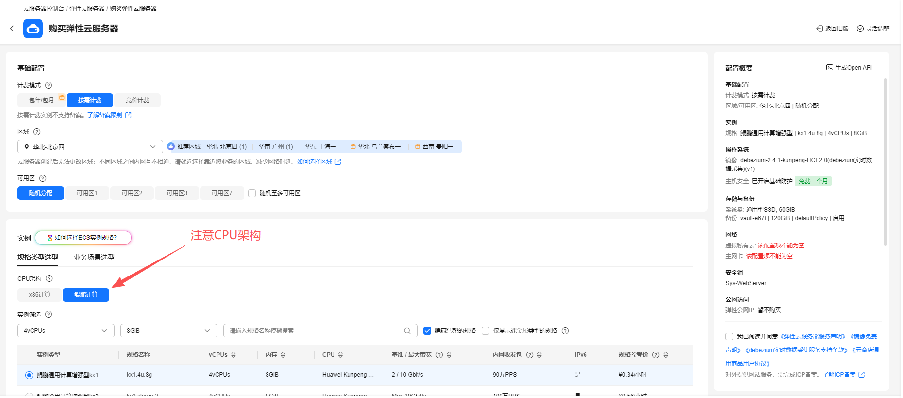
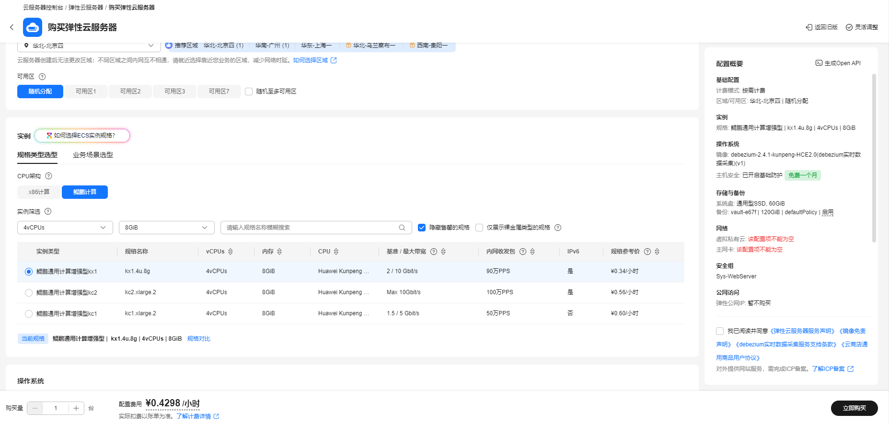
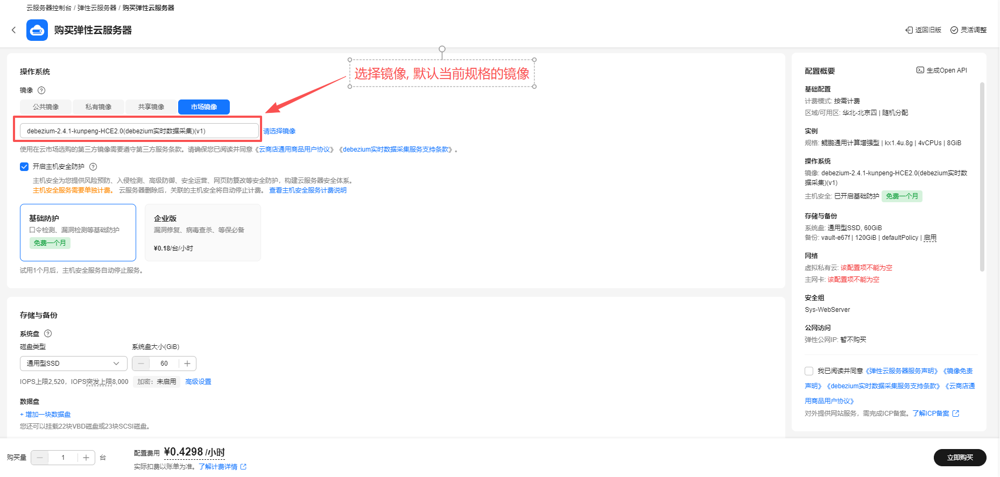
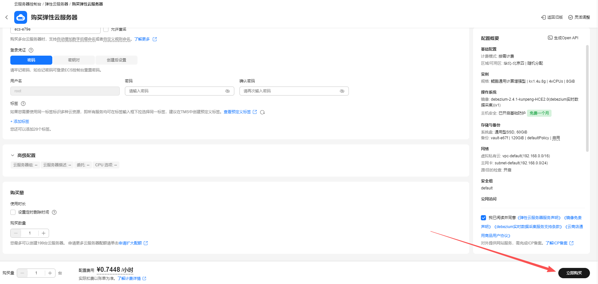

# Debezium使用指南

# 一、商品链接

[Debezium实时数据采集](https://marketplace.huaweicloud.com)

# 二、商品说明
**Debezium** 是一个捕获数据更改(change data capture,CDC)低延迟的流式处理平台。用户安装并且配置Debezium去监控数据库，然后就可以消费对数据库的每一个行级别(row-level)的更改。

# 三、商品购买

您可以在云商店搜索 **Debezium实时数据采集**。

其中，地域、规格、推荐配置使用默认，购买方式根据您的需求选择按需/按月/按年，短期使用推荐按需，长期使用推荐按月/按年，确认配置后点击“立即购买”。


## 3.1 使用 RFS 模板直接部署

必填项填写后，点击 下一步


创建直接计划后，点击 确定


点击部署，执行计划

如下图“Apply required resource success. ”即为资源创建完成


##  3.2 ECS 控制台配置

### 准备工作

在使用ECS控制台配置前，需要您提前配置好 **安全组规则**。

> **安全组规则的配置如下：**
> - 入方向规则 放通2181,2888,3888,8083,9092 端口,如指定ip,对应的源地址内必须包含您的客户端ip，否则无法访问 
> - 入方向规则放通 CloudShell 连接实例使用的端口 `22`，以便在控制台登录调试
> - 出方向规则一键放通

### 创建ECS

前提工作准备好后，选择 ECS 控制台配置跳转到[购买ECS](https://support.huaweicloud.com/qs-ecs/ecs_01_0103.html) 页面，ECS 资源的配置如下图所示：

选择CPU架构

选择服务器规格

选择镜像

其他参数根据实际情况进行填写，填写完成之后，点击立即购买即可



> **值得注意的是：**
> - VPC 您可以自行创建
> - 安全组选择 [**准备工作**](#准备工作) 中配置的安全组；
> - 弹性公网IP选择现在购买，推荐选择“按流量计费”，带宽大小可设置为5Mbit/s；
> - 高级配置需要在高级选项支持注入自定义数据，所以登录凭证不能选择“密码”，选择创建后设置；
> - 其余默认或按规则填写即可。

# 四、商品使用

## 修改服务器域名
```shell
vim /etc/hosts
192.168.0.X ecs-0000  修改成本机服务器ip及对应ecs名称
```

## 启动本机mysql服务
```shell
sudo systemctl start mysqld
```
* 登录mysql确认binglog 已开启,账号/密码: root 123456
```SQL
SHOW VARIABLES LIKE '%log_bin%';   --log_bin 的值为 ON
```

## 分别先后启动zookeeper/kafka/connect依赖服务
```shell
cd /usr/local/kafka
sh /usr/local/zookeeper/zookeeper/bin/zkServer.sh start
sh /usr/local/kafka/bin/kafka-server-start.sh -daemon config/server.properties
sh /usr/local/kafka/bin/connect-distributed.sh -daemon config/connect-distributed.properties
```

## 开启debezium-mysql-connector服务  
在 /usr/local/source-mysql.json 路径下编辑 Jason文件, 把相关配置项替换成实际信息.    
启动服务:  
curl -H "Content-Type: application/json" -X POST -d "@/usr/local/source-mysql.json" http://192.168.0.X:8083/connectors/    
检查服务启动情况   
curl http://192.168.0.X:8083/connectors  

## 使用公网ip访问connector的web 页面
查看topic及插件信息   
http://1.2.3.4:8083/connectors/debezium-mysql-connector/topics/   
http://1.2.3.4:8083/connector-plugins   

## 消费binlog日志
以样例库表举例   
sh /usr/local/kafka/bin/kafka-console-consumer.sh --bootstrap-server 192.168.0.X:9092 --topic mysql-dzm.bigdata.players --from-beginning  
会看到players表全量的日志信息。  
在数据库对players表进行增/删/改操作 日志信息会实时被捕获到并在屏幕打印。  


## 参考文档

[Debezium官网](https://debezium.io/)
